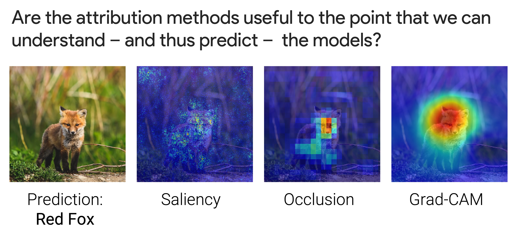
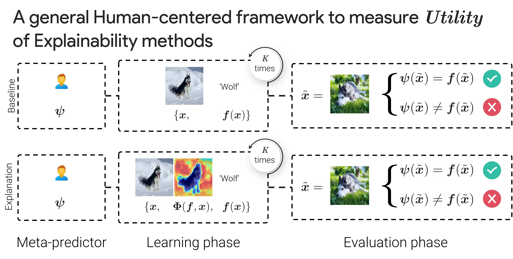
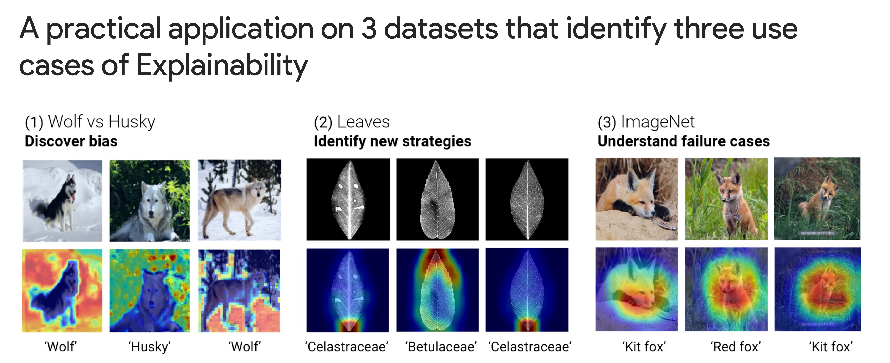
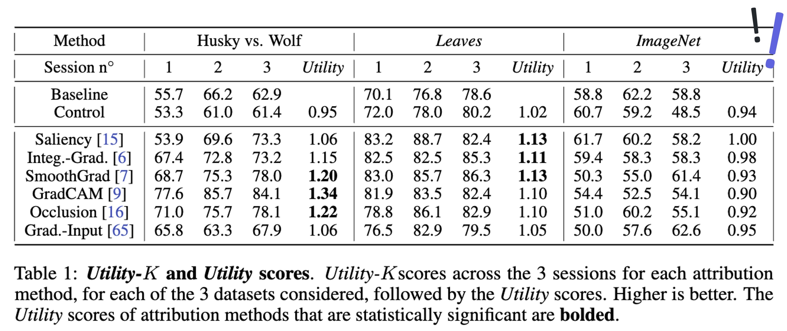
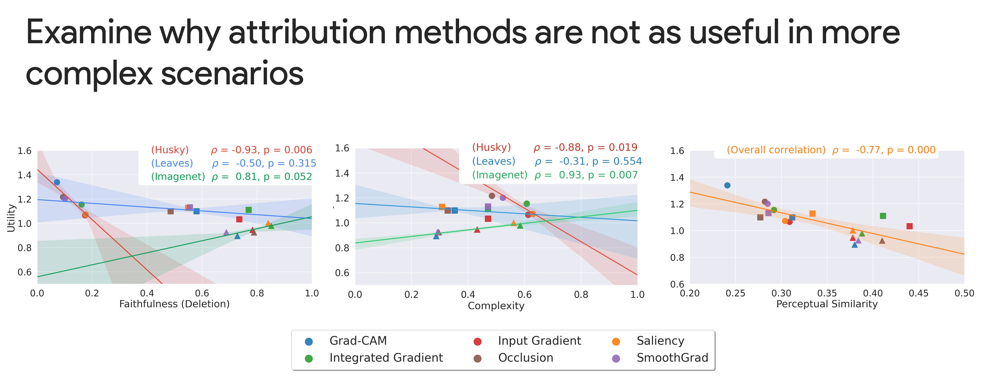

# 🔮 What I Cannot Predict, I Do Not Understand: A Human-Centered Evaluation Framework for Explainability Methods

_Julien Colin*, Thomas Fel*, Rémi Cadène, Thomas Serre_


<p align="center">
  <a href="https://arxiv.org/abs/2112.04417"><strong>Read the official paper »</strong></a>
  <br>
  <br>
  <a href="https://serre-lab.github.io/Meta-predictor/">Documentation</a>
  ·
  <a href="https://github.com/serre-lab/Meta-predictor">Github</a>
  .
  <a href="https://serre-lab.github.io/Meta-predictor/tutorials">Tutorials (coming soon)</a>
</p>

## Paper summary



A multitude of explainability methods and associated fidelity performance metrics
have been proposed to help better understand how modern AI systems make decisions. However, much of the current work has remained theoretical – without
much consideration for the human end-user. In particular, it is not yet known
**(1) how useful current explainability methods are in practice** for more real-world
scenarios and
**(2) how well associated performance metrics accurately predict how much knowledge individual explanations contribute to a human end-user trying to understand the inner-workings of the system**.

To fill this gap, we conducted
psychophysics experiments at scale ($n = 1,150$) to evaluate the usefulness of attribution methods in three real-world scenarios:
_identifying bias in an AI system_,
_characterizing the visual strategy it uses for tasks that are too difficult_ for an untrained non-expert human observer as well as _understanding its failure cases_.

Our results demonstrate that the degree to which individual attribution methods help human participants better understand an AI system varied
widely across these scenarios. This suggests a critical need for the field to move
past quantitative improvements of current attribution methods towards the development of complementary approaches that provide qualitatively different sources of
information to human end-users.

### Human-centered Framework



In this work, we propose to measure the usefulness of attribution methods, i.e., do they help users to understand how a model works beyond simply observing how it classifies images.

More precisely, we evaluate how much attribution maps help training users at getting better at predicting a models’ decisions on unseen images.
The utility score are computed from the relative improvement of users in accuracy with vs. without the attribution maps in training.

### 3 Datasets, 3  Use cases



We evaluate the usefulness of representative attribution methods on 3 important use cases for eXplainable AI in vision:

  - (1) Bias detection
  - (2) Identify novel strategies discovered by an expert AI system
  - (3) Understand failure cases of an AI system


### Results



We find mixed results: current attribution methods are helpful in simple use cases but none of the methods were helpful in diagnosing more challenging failure cases of the system.
This result highlights a fundamental challenge for XAI,  that, we argue, cannot be overcome by attribution methods alone, but that will require qualitatively different sources of information for human end-users.

### Going beyond attribution method ?



We explored several possibilities for why attribution methods are not as useful in more complex scenarios. Making attribution methods (1) more faithful or (2) less visually complex does not seem like  a promising avenue for future research.  We argue instead for methods that will contribute novel “what” information to the user beyond the “where” information contributed by attribution methods.


## 🗞️ Citation

If you use or build on our work as part of your workflow in a scientific publication, please consider citing the [official paper](https://arxiv.org/abs/2211.04533):

```
@article{colin2022metapredictor,
  title={What I Cannot Predict, I Do Not Understand: A Human-Centered Evaluation Framework for Explainability Methods},
  author={Colin, Julien and Fel, Thomas and Cadene, Remi and Serre, Thomas},
  journal={Advances in Neural Information Processing Systems (NeurIPS)},
  year={2022}
}
```

## Tutorials

Coming soon: a tutorial to evaluate your own explainability method.


## 📝 License

The package is released under <a href="https://choosealicense.com/licenses/mit"> MIT license</a>.